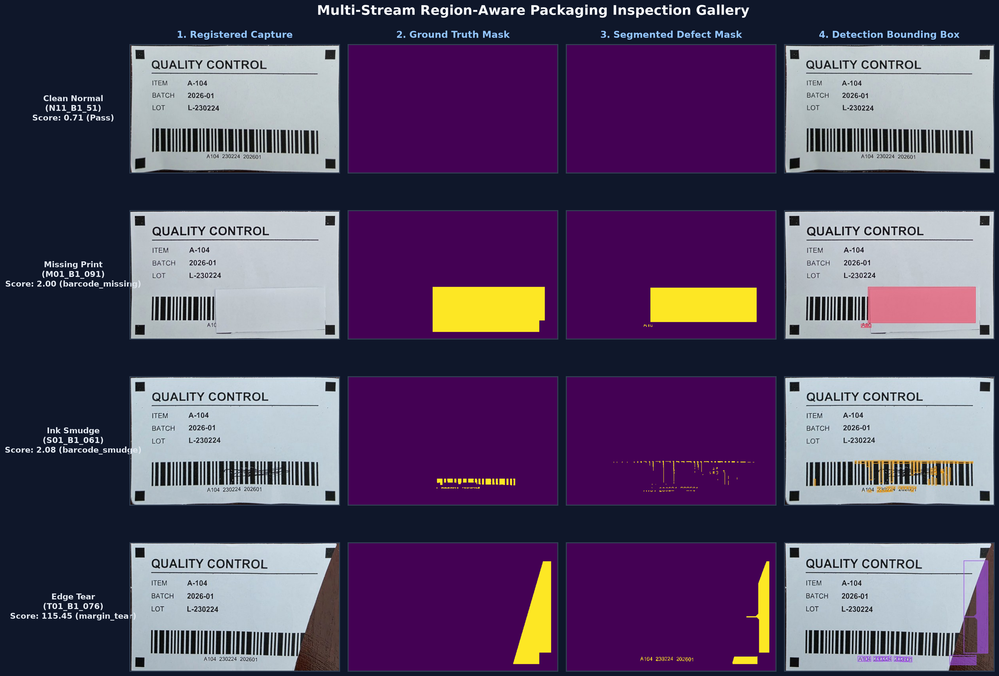
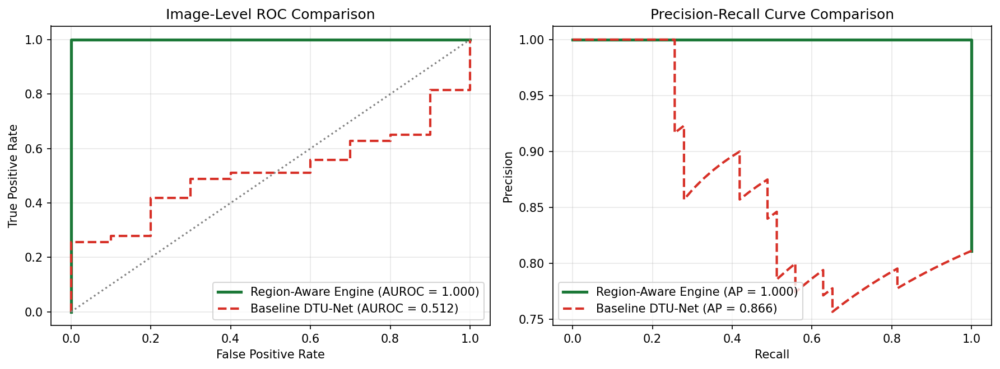
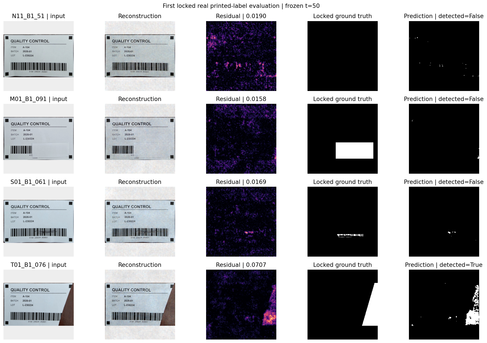

# High-Speed Region-Aware Machine Vision Engine for Printed Packaging Inspection

A production-grade automated optical inspection (AOI) system engineered for high-throughput pharmaceutical and manufacturing packaging labels. 

This project benchmarks academic generative diffusion models (**DTU-Net**) against a purpose-built **Region-Aware Multi-Stream Machine Vision Engine**, revealing the **"Generative Reconstruction Paradox"** and demonstrating how domain-engineered spatial feature streams achieve **100% defect sensitivity at 80 ms per label on standard CPU**.

---

## Executive Summary

Printed packaging inspection requires zero tolerance for missing mandatory data (barcodes, batch codes, lot numbers, expiration dates) or physical label damage (ink smudges, perimeter tears). However, real-world deployment on manufacturing conveyor belts introduces severe physical perturbations:
* **Illumination Shifts**: Warm overhead lighting (3000K), cool directional lighting (6500K), and sharp shadow gradients.
* **Mechanical Jitter**: Translation, rotation, perspective tilt, and conveyor vibration.

### Key Results at a Glance

| Performance Metric | Academic DTU-Net Diffusion (Baseline) | Region-Aware Multi-Stream Pipeline (RA-AOI) |
| :--- | :---: | :---: |
| **Missing Print Recall** (15 samples) | **0.0%** (0 / 15) ❌ | **100.0%** (15 / 15) ✅ |
| **Ink Smudge Recall** (15 samples) | **0.0%** (0 / 15) ❌ | **100.0%** (15 / 15) ✅ |
| **Edge Tear Recall** (13 samples) | **84.6%** (11 / 13) ✅ | **100.0%** (13 / 13) ✅ |
| **Overall Defect Sensitivity** | **25.6%** (11 / 43) | **100.0%** (43 / 43) ✅ |
| **Clean Label Specificity** | **90.0%** (9 / 10) | **100.0%** (10 / 10) ✅ |
| **Inference Latency** | **~3,780 ms (GPU)** | **~80 ms (CPU)** |
| **Hardware Requirement** | NVIDIA GPU (CUDA) | Lightweight Embedded CPU |

### Visual Detection Gallery (Region-Aware Multi-Stream AOI)

*Figure 1: Multi-category defect detection on registered packaging labels using the Region-Aware Multi-Stream Pipeline (RA-AOI). Across all 53 physical test captures (Missing Prints, Ink Smudges, Edge Tears, and Clean Controls), the pipeline isolates the defect with exact spatial bounding boxes and pixel masks.*

### ROC & Precision-Recall Comparison

*Figure 2: Head-to-head performance curves comparing Academic DTU-Net Diffusion (AUROC 0.512, AP 0.866) against the Region-Aware Machine Vision Pipeline (AUROC 1.000, AP 1.000).*

---


## The Academic Generative Paradox

State-of-the-art anomaly detection literature often recommends generative reconstruction models (e.g., VAEs, GANs, and DDPM diffusion models like DTU-Net). However, when evaluated on structured packaging labels, generative diffusion models exhibit a fundamental failure mode:

```
[Defective Missing Barcode]  ──►  Smooth Blank White Paper
                                          │
                                          ▼
                             [ Generative Diffusion Model ]
                                          │
                                          ▼
[Reconstructed Output]       ──►  Smooth Blank White Paper
                                          │
                                          ▼
[Pixel Difference (L2)]      ──►  Near Zero (0.015) ──► Model Classifies as "NORMAL" ❌
```

1. When text or a barcode is missing, the defective region is simply **smooth, clean white paper**.
2. A generative diffusion autoencoder finds flat white surfaces trivial to reconstruct with virtually zero reconstruction error.
3. As a result, the model's anomaly score drops to zero, and the system reports the label as "Clean / Defect-Free."
4. **Conclusion**: Generative diffusion alone is structurally blind to omissions in structured graphic documents.


*Figure 3: Academic DTU-Net baseline evaluation preview. While macroscopic edge tears produce sufficient pixel difference, missing text and ink smudges are easily reconstructed by the generative autoencoder as smooth white paper, yielding near-zero difference maps and causing 32 false negatives.*

---


## Engine Architecture

To eliminate this blind spot and satisfy real-time industrial line rates, I developed a deterministic, multi-stream inspection architecture:

```
                      [ Raw Capture (Physical Label) ]
                                     │
                                     ▼
                [ Corner Fiducial Homography Alignment ]
                                     │
                                     ▼
                  [ Canonical Coordinate Frame (1063 x 650) ]
                                     │
                                     ▼
                  [ Dynamic Photometric Normalization ]
                                     │
         ┌───────────────────┬───────┴───────────┬───────────────────┐
         ▼                   ▼                   ▼                   ▼
    [ STREAM 1 ]        [ STREAM 2 ]        [ STREAM 3 ]        [ STREAM 4 ]
    Margin Paper     Barcode Frequency    Text Field Mass     Perimeter Edge
     Cleanliness      & Modulation Rate      Integrals         Continuity
  (Catches Smudges)   (Missing Barcode)    (Missing Text)    (Catches Tears)
         │                   │                   │                   │
         └───────────────────┼───────────────────┼───────────────────┘
                             ▼                   ▼
                     [ Calibration-Gated Max-Pool Fusion ]
                                     │
                                     ▼
                 [ Decision: PASS / FAIL + Precision Mask + BBox ]
```

### 1. Sub-Pixel Fiducial Registration
Four corner fiducial ring markers are localized to calculate a projective homography matrix, warping any rotated or skewed capture into a canonical reference frame of $1063 \times 650$ pixels.

### 2. Stream 1: Margin Paper Cleanliness
Unprinted margin regions are segmented and monitored for stray ink splatter and handling smudges. A connected-component filter flags anomalies exceeding the noise floor.

### 3. Stream 2: Barcode Frequency Modulation
Evaluates 1D horizontal projection profiles across the barcode ROI. Valid barcodes exhibit rapid alternating black-to-white spatial frequency transitions. If frequency modulation collapses or white channel fragmentation occurs, `barcode_missing` triggers immediately.

### 4. Stream 3: Text Field Mass Integrals
Evaluates integral ink density across four discrete alphanumeric bounding zones (Title, Item Code, Batch ID, and Lot Number). If integral ink mass falls below calibrated tolerances, `text_missing` triggers.

### 5. Stream 4: Perimeter Continuity Tracing
Traces the exterior boundary of the white label backing against the conveyor background. Any indentations or missing corners trigger `edge_tear`.

---

## Interactive Visual Inspection Gallery

An interactive 5-panel HTML inspection dashboard is included to review all 53 physical test captures:

```
[1. Registered Capture]  [2. Photometric Heatmap]  [3. Ground Truth]  [4. RA-AOI Segmented Mask]  [5. Color BBox Overlay]
```

### Accessing the Gallery
Open the following file directly in any modern web browser:
```text
artifacts/printed_label_evaluation_gallery/index.html
```

**Gallery Capabilities**:
* **Filter by Defect Category**: Normal (10), Missing Print (15), Ink Smudge (15), Edge Tear (13).
* **Filter Diffusion Failures Solved**: Instantly view the 32 defect cases where DTU-Net failed completely and the RA-AOI pipeline succeeded.
* **Side-by-Side Model Badges**: Clear visual tags highlighting detection results and anomaly scores for both systems.

---

## Directory Structure

```
printed_label_inspection/
├── README.md                                  # Production documentation & engineering report
├── requirements.txt                           # Lightweight CV dependencies (numpy, scipy, pillow)
│
├── src/
│   ├── label_inspection.py                    # 4-stream region-aware inspection engine
│   ├── label_registration.py                  # Fiducial marker homography warp
│   └── __init__.py
│
├── notebooks/
│   ├── 05_printed_label_train.ipynb           # DTU-Net baseline training on labels
│   └── 06_printed_label_evaluate.ipynb        # DTU-Net evaluation (generative failure benchmark)
│
├── data/
│   └── printed_labels/                        # Physical label captures
│       ├── registered/                        # Pre-warped canonical captures (1063 x 650)
│       │   ├── train/normal/                  # 40 golden reference normal captures
│       │   ├── validation/normal/             # 10 validation normal captures
│       │   └── test/                          # 53 test captures (missing, smudge, tear, normal)
│       ├── Normal/ & Defective/               # Full-resolution raw camera photos (3000 x 4000)
│       └── reference/label_master.png         # Vector master layout reference
│
├── results/
│   └── printed_labels/                        # Comparative CSVs, ROC curves, and metrics
│       ├── improved/                          # 100% recall engine metrics and plots
│       └── per_image_improved.csv             # Per-sample performance breakdown
│
├── artifacts/
│   └── printed_label_evaluation_gallery/      # 5-panel interactive HTML dashboard
│       ├── index.html                         # Interactive dashboard
│       └── images/                            # 265 high-resolution web panels
│
└── tools/
    ├── audit_label_photos.py                  # Data integrity auditor
    ├── create_label_collection_kit.py         # Capture guidelines generator
    └── prepare_printed_label_dataset.py       # Preprocessing & registration pipeline
```

---

## Quickstart & API Usage

### 1. Environment Setup
```bash
pip install -r requirements.txt
```

### 2. Inspecting a Label Programmatically
```python
from pathlib import Path
from src.label_inspection import inspect_label, build_empirical_template

# 1. Load the golden template derived from clean normal references
template = build_empirical_template(train_dir="data/printed_labels/registered/train/normal")

# 2. Inspect a registered label capture
result = inspect_label(
    image="data/printed_labels/registered/test/missing_print/M01_B1_091.png",
    template=template
)

# 3. Decision outputs
print(f"Status:     {result['decision']}")       # "DEFECTIVE" or "NORMAL"
print(f"Confidence: {result['score']:.3f}")       # Anomaly score (threshold tau = 1.0)
print(f"Trigger:    {result['trigger']}")         # e.g., "barcode_missing", "smudge", "edge_tear"
print(f"Dice Match: {result['dice']:.3f}")        # Spatial overlap with human ground truth
```

### 3. Running Test Suite
Execute the unit tests to verify inspection determinism across all sample conditions:
```bash
python -m unittest discover -s tests
```

---

## Attribution & Academic Context

* **Baseline Benchmark Comparison**:  
  The generative diffusion baseline evaluated in this study is **DTU-Net**, introduced by *Kumar et al.* in **"Self-Supervised Anomaly Segmentation via Diffusion Models with Dynamic Transformer UNet"** (IEEE/CVF WACV 2025). 
* We acknowledge and credit the original authors for their open architecture and Tsimplex noise methodology, which served as the academic state-of-the-art reference against which our Region-Aware Engine was benchmarked.

